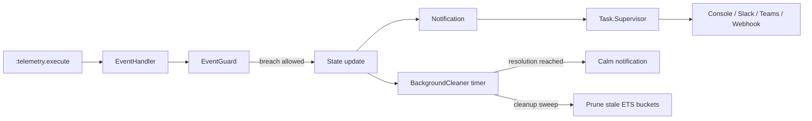

# NatureWhistle

<p align="center">
  
</p>

[](https://github.com/andrewinsoul/nature_whistle/actions/workflows/elixir.yml)
[](https://hex.pm/packages/nature_whistle)
[](https://hex.pm/packages/nature_whistle)
[](https://github.com/andrewinsoul/nature_whistle/blob/main/LICENSE)

_Let your system whisper its troubles before they become screams._

**NatureWhistle** is a telemetry-driven alerting library for Elixir applications. It listens to `:telemetry` events, evaluates them against alert rules stored in ETS, and sends notifications to Slack, Microsoft Teams, generic webhooks, or the console.

It is designed for simple setup and low runtime overhead:

- telemetry handlers run in the emitting process
- alert definitions live in application config
- notification delivery happens asynchronously through `Task.Supervisor`
- alert state and rate-limiting data are tracked in ETS tables

## How It Works



When an event arrives:

1. `NatureWhistle.EventHandler` looks up all alerts for that telemetry event.
2. The measurement value is extracted from the telemetry payload.
3. `NatureWhistle.EventGuard` applies rate-limit and sliding-window checks.
4. If the breach is allowed, the alert state is marked as breached and an alert notification is queued.
5. `NatureWhistle.BackgroundCleaner` later resolves the alert and sends the calm notification once the resolution timer expires.

## Features

- Telemetry-driven alerts for any Elixir or Erlang application
- Alert and calm notifications
- Built-in console, Slack, Teams, and generic webhook notifiers
- Exponential retry for HTTP delivery
- ETS-backed state for fast lookup and minimal runtime coupling
- Optional rate limiting and sliding-window suppression
- Custom value formatting for alert messages

## 🚀 Installation & Setup

Add `nature_whistle` to your `mix.exs` dependencies:

```elixir
defp deps do
  [
    {:nature_whistle, "~> 0.3.0"}
  ]
end
```

Then add `NatureWhistle.Application` to your supervision tree:

```elixir
def start(_type, _args) do
  children = [
    MyApp.Repo,
    MyAppWeb.Endpoint,
    NatureWhistle.Application
  ]

  Supervisor.start_link(children, strategy: :one_for_one)
end
```

## Configuration

Configure NatureWhistle from `config/config.exs`:

```elixir
config :nature_whistle,
  retry: [
    max_attempts: 5,
    base_delay_ms: 1_000,
    max_delay_ms: 60_000
  ],
  notifiers_config: [
    %{name: :console, service: :console, config: %{}},
    %{
      name: :slack_primary,
      service: :slack,
      config: %{webhook_url: "https://hooks.slack.com/services/T00/B00/X00"}
    },
    %{
      name: :ops_webhook,
      service: :webhook,
      config: %{
        webhook_url: "https://api.example.com/alerts",
        method: :post,
        headers: [{"x-api-key", "secret"}],
        payload: %{source: "nature_whistle"}
      }
    }
  ],
  alerts: [
    %{
      id: :high_cpu_load,
      event: [:vm, :total_run_queue_lengths, :total],
      measurement_key: :total,
      threshold: 4,
      alert_message: "🚨 High CPU load: run queue is %{value}",
      calm_message: "✅ CPU load back to normal: %{value}",
      resolution_ms: 60_000,
      rate_limit: [window_ms: 60_000, max_events: 10],
      sliding_window: [window_ms: 30_000, max_events: 3],
      notifiers: [:console]
    },
    %{
      id: :api_latency,
      event: [:my_app, :request, :stop],
      measurement_key: :duration,
      threshold: 500,
      formatter: fn duration -> "#{div(duration, 1_000)} ms" end,
      alert_message: "⚠️ Slow request: %{value}",
      calm_message: "✅ Request latency recovered: %{value}",
      resolution_ms: 30_000,
      notifiers: [:slack_primary, :ops_webhook]
    }
  ]
```

## Alert Reference

| Field             | Required                     | Description                                                                                                                  |
| ----------------- | ---------------------------- | ---------------------------------------------------------------------------------------------------------------------------- |
| `id`              | Yes                          | Unique alert identifier used for ETS state.                                                                                  |
| `event`           | Yes                          | Telemetry event name, for example `[:vm, :memory, :total]`.                                                                  |
| `measurement_key` | No, defaults to `:value`     | Key in the telemetry measurements map that holds the numeric value.                                                          |
| `threshold`       | Yes                          | Alert triggers when `value >= threshold`.                                                                                    |
| `alert_message`   | No                           | Message used when the metric crosses the threshold. Supports `%{value}`.                                                     |
| `calm_message`    | No                           | Message used when the metric returns to normal. Supports `%{value}`.                                                         |
| `formatter`       | No                           | Optional one-argument function for custom value formatting.                                                                  |
| `resolution_ms`   | No, defaults to `60_000`     | How long the metric must stay below the threshold before a calm message is sent.                                             |
| `notifiers`       | No, defaults to `[:console]` | List of notifier profile names to use for this alert.                                                                        |
| `rate_limit`      | No, defaults to `nil`        | Optional traffic cap that blocks repeated dispatches once `max_events` are seen within `window_ms`.                          |
| `sliding_window`  | No, defaults to `nil`        | Optional breach-density gate that counts recent breaches in rolling buckets and suppresses alerting once the cap is reached. |

### Important note on timing

The current runtime uses `resolution_ms` as the active alert lifecycle timer. The alert remains in a breached state until that timer expires or is extended by another breach. `debounce_ms` is stored in the loaded alert config, but it is not part of the active runtime decision path yet.

## Notifier Profiles

`notifiers_config` defines the actual delivery endpoints, and each alert chooses from those profiles by name.

### Console

```elixir
%{name: :console, service: :console, config: %{}}
```

### Slack

```elixir
%{
  name: :slack_primary,
  service: :slack,
  config: %{webhook_url: "https://hooks.slack.com/services/..."}
}
```

### Teams

```elixir
%{
  name: :teams_primary,
  service: :teams,
  config: %{webhook_url: "https://outlook.office.com/webhook/..."}
}
```

### Generic webhook

```elixir
%{
  name: :ops_webhook,
  service: :webhook,
  config: %{
    webhook_url: "https://your.service/hook",
    method: :post,
    headers: [{"x-api-key", "abc"}],
    payload: %{source: "nature_whistle"}
  }
}
```

## Built-in Behavior

- `NatureWhistle.Application`
  - creates the ETS tables `:nature_whistle_alerts`, `:nature_whistle_alert_state`, and `:nature_whistle_rate_limit`
  - loads alert config into ETS
  - attaches telemetry handlers for each configured event
  - starts `NatureWhistle.TaskSupervisor`
  - starts `NatureWhistle.BackgroundCleaner`
- `NatureWhistle.EventHandler`
  - extracts the configured measurement
  - checks rate limits and sliding windows
  - starts or extends the resolution timer
  - queues alert notifications
- `NatureWhistle.BackgroundCleaner`
  - sends calm notifications when resolution timers expire
  - prunes stale rate-limit and sliding-window buckets on sweep
- `NatureWhistle.Notification`
  - formats values
  - expands `%{value}` in messages
  - dispatches to the chosen notifier profile asynchronously
- `NatureWhistle.Notifier.Retry`
  - retries failed HTTP requests with exponential backoff

## Default Alerts

If you do not define `:alerts`, NatureWhistle ships with two built-in console alerts:

- high memory usage
- high CPU run-queue length

The CPU run-queue alert is scaled by the number of schedulers on startup, so it stays proportional to the machine it is running on.

## Telemetry Example

Emit your own telemetry event like this:

```elixir
:telemetry.execute(
  [:my_app, :db, :query],
  %{duration: 650},
  %{query: "SELECT * FROM users"}
)
```

Then add a matching alert:

```elixir
%{
  id: :slow_query,
  event: [:my_app, :db, :query],
  measurement_key: :duration,
  threshold: 500,
  alert_message: "🐢 Slow query: %{value}",
  calm_message: "✅ Query speed recovered: %{value}",
  resolution_ms: 60_000,
  notifiers: [:console]
}
```

## Message Formatting

- `%{value}` is replaced with the current measurement value.
- `[:vm, :memory, :total]` values are automatically rendered in megabytes.
- If a custom `formatter` raises, NatureWhistle falls back to `to_string/1` and logs the formatter error.

## Why NatureWhistle

NatureWhistle sits between raw telemetry and full observability stacks. If you already emit metrics with tools like Phoenix, Ecto, Oban, or PromEx, it gives you a lightweight alerting path without introducing a separate alert manager or a new service to operate.

Use it when you want:

- immediate notification on threshold breaches
- a calm message when the system recovers
- simple config-driven alerting
- minimal overhead in the hot path

## License

MIT
