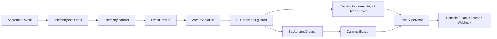

# NatureWhistle

<p align="center">
  
</p>

[](https://github.com/andrewinsoul/nature_whistle/actions/workflows/elixir.yml)
[](https://hex.pm/packages/nature_whistle)
[](https://hex.pm/packages/nature_whistle)
[](https://github.com/andrewinsoul/nature_whistle/blob/main/LICENSE)

_Let your system whisper its troubles before they become screams._

**NatureWhistle** is a telemetry-driven alerting library for Elixir applications. It listens to `:telemetry` events, evaluates them against alert rules stored in ETS, and sends notifications to Slack, Microsoft Teams, generic webhooks, or the console.

It is designed for simple setup and low runtime overhead:

- telemetry handlers run in the emitting process
- alert definitions can be loaded from application config or registered at runtime
- notification delivery happens asynchronously through `Task.Supervisor`
- alert state, failure aggregation, and rate-limiting data are tracked in ETS tables

## How It Works


```mermaid
flowchart LR
  A[Application event] --> B[:telemetry.execute/3]
  B --> C[Telemetry handler]
  C --> D[EventHandler]
  D --> E[Alert evaluation]
  E --> F[ETS state and guards]
  F --> G[Notification formatting of breach alert]
  G --> H[Task.Supervisor]
  H --> I[Console / Slack / Teams / Webhook]
  F --> J[BackgroundCleaner]
  J --> K[Calm notification]
  K --> H
```

When a telemetry event arrives:

1. `NatureWhistle.EventHandler` looks up all alerts for that telemetry event.
2. The measurement value is extracted from the telemetry payload.
3. `NatureWhistle.EventGuard` applies rate-limit and sliding-window checks.
4. Aggregate alerts can pass repeated failures through `NatureWhistle.FailureTracker` to determine whether the configured failure threshold has been reached within an aggregation window.
5. If the breach is actionable, the alert state is marked as breached and an alert notification is queued.
6. Metric alerts enter recovery when a healthy measurement is received and remain
   healthy for `resolution_ms`; aggregate alerts recover when their active failure
   windows expire; correlated event alerts recover when their matching recovery
   event satisfies the configured predicate.
7. `NatureWhistle.BackgroundCleaner` manages metric-resolution timers, aggregate
   recovery sweeps, and stale guard-state cleanup.
8. Runtime alerts can be added or removed without restarting the application.

## Features

- Telemetry-driven alerts for any Elixir or Erlang application
- Three alert primitives: metric, event, and aggregate
- Alert and calm notifications
- Runtime alert registration and unregistration
- Built-in console, Slack, Teams, and generic webhook notifiers
- Exponential retry for HTTP delivery
- ETS-backed state for fast lookup and minimal runtime coupling
- Failure aggregation within configurable time windows
- Optional rate limiting and sliding-window suppression
- Custom value formatting for alert messages
- Built-in BEAM runtime monitoring
- Configurable BEAM metric thresholds and per-metric disabling

## Alert Primitives

NatureWhistle supports three alert primitives:

### Metric

A metric alert fires when a numeric measurement crosses a configured threshold.

```elixir
%{
  id: :api_latency,
  event: [:my_app, :request, :stop],
  condition: :metric,
  measurement_key: :duration,
  threshold: 500,
  alert_message: "⚠️ Slow request: %{value}",
  calm_message: "✅ Request latency recovered: %{value}",
  notifiers: [:console]
}
```

### Event

An event alert reacts to the occurrence of a telemetry event. It is useful when the event itself is the signal rather than a numeric threshold.

```elixir
%{
  id: :worker_crashed,
  event: [:my_app, :worker, :crash],
  condition: :event,
  alert_message: "🚨 Worker crash detected",
  notifiers: [:console]
}
```

An event alert reacts to occurrence; it does not automatically know when the
problem is resolved and therefore does not automatically send a calm message.
Add `correlation` when another telemetry event represents recovery:

```elixir
%{
  id: :worker_crashed,
  event: [:my_app, :worker, :crash],
  condition: :event,
  correlation: %{
    key: fn metadata -> metadata.worker end,
    recovery_event: [:my_app, :worker, :healthy],
    recovery?: fn metadata -> metadata.status == :ok end
  },
  alert_message: "🚨 Worker crash detected",
  calm_message: "✅ Worker recovered",
  notifiers: [:console]
}
```

NatureWhistle correlates the failure and recovery using the value returned by
`key`. A recovery for a different key does not match the failed occurrence. When
the recovery predicate matches, NatureWhistle sends the calm notification and
clears that correlation record.

### Aggregate

An aggregate alert turns repeated failures into an actionable signal. Failures must reach the configured threshold within the aggregation window.

```elixir
%{
  id: :repeated_failures,
  event: [:my_app, :job, :failure],
  condition:
    {:aggregate,
     [
       key: fn metadata -> Map.get(metadata, :job_id) end,
       failures: 5,
       within_ms: 60_000
     ]},
  alert_message: "🚨 Repeated failures: %{value}",
  calm_message: "✅ Failure rate recovered",
  notifiers: [:console]
}
```

Aggregate options are a keyword list. The required `:key` function receives telemetry metadata and returns the logical identity whose failures should be counted, such as a job ID, worker, endpoint, or tenant. Failures for different keys are tracked independently.

`NatureWhistle.FailureTracker` determines when repeated failures become significant. Once the aggregate threshold is reached, the count flows through the same normal alert state, guard, and notification machinery used by the other alert primitives. When the aggregation window expires, the tracker reports recovery and NatureWhistle clears the breached state and sends the configured calm notification. If an alert has multiple active failure keys, it is resolved only after all active keys have recovered.

## 🚀 Installation & Setup

Add `nature_whistle` to your `mix.exs` dependencies:

```elixir
defp deps do
  [
    {:nature_whistle, "~> 0.4.1"}
  ]
end
```

`NatureWhistle.Application` is started automatically as the dependency's OTP
application. You do not need to add it as a second child in your supervision
tree. Configure the application and start your normal application as usual.

If your application deliberately uses `runtime: false` or starts dependencies
manually, start `:nature_whistle` explicitly before registering alerts or
emitting telemetry events.

## Configuration

Configure NatureWhistle from `config/config.exs`:

```elixir
config :nature_whistle,
  retry: [
    max_attempts: 5,
    base_delay_ms: 1_000,
    max_delay_ms: 60_000
  ],
  packs: [
    {NatureWhistle.Packs.Beam,
     thresholds: [
       memory: 1_073_741_824,
       process_count: 50_000,
       run_queue: 4
     ]}
  ],
  notifiers_config: [
    %{name: :console, service: :console, config: %{}},
    %{
      name: :slack_primary,
      service: :slack,
      config: %{webhook_url: "https://hooks.slack.com/services/T00/B00/X00"}
    },
    %{
      name: :ops_webhook,
      service: :webhook,
      config: %{
        webhook_url: "https://api.example.com/alerts",
        method: :post,
        headers: [{"x-api-key", "secret"}],
        payload: %{source: "nature_whistle"}
      }
    }
  ],
  alerts: [
    %{
      id: :high_cpu_load,
      event: [:vm, :total_run_queue_lengths, :total],
      measurement_key: :total,
      threshold: 4,
      alert_message: "🚨 High CPU load: run queue is %{value}",
      calm_message: "✅ CPU load back to normal: %{value}",
      resolution_ms: 60_000,
      rate_limit: [window_ms: 60_000, max_events: 10],
      sliding_window: [window_ms: 30_000, max_events: 3],
      notifiers: [:console]
    },
    %{
      id: :api_latency,
      event: [:my_app, :request, :stop],
      measurement_key: :duration,
      threshold: 500,
      formatter: fn duration -> "#{div(duration, 1_000)} ms" end,
      alert_message: "⚠️ Slow request: %{value}",
      calm_message: "✅ Request latency recovered: %{value}",
      resolution_ms: 30_000,
      notifiers: [:slack_primary, :ops_webhook]
    }
  ]
```

## Runtime Alert Registration

Alerts do not have to be known when the application starts. You can register and unregister alerts while the BEAM is running.

### Register an alert

```elixir
NatureWhistle.register_alert(%{
  id: :manual_test_alert,
  event: [:nature_whistle, :manual_test],
  condition: :metric,
  measurement_key: :duration,
  threshold: 1_000,
  alert_message: "🚨 Manual test alert: %{value}ms",
  calm_message: "✅ Manual test alert recovered: %{value}ms",
  notifiers: [:console]
})
```

A successful registration returns:

```elixir
{:ok, alert}
```

The alert is immediately available to the runtime alert registry and its telemetry event is wired into the normal NatureWhistle event handling path.

### Unregister an alert

```elixir
NatureWhistle.unregister_alert(:manual_test_alert)
```

This removes the alert and its associated runtime state.

Runtime alerts are **ephemeral**. They live in memory and are lost when the BEAM/application restarts. Use application configuration for alerts that should be restored automatically after a restart.

### Runtime registration behavior

- Alert IDs must be unique.
- Registering an existing alert ID returns `{:error, :already_registered}`.
- Registration uses the same alert normalization and notification pipeline as configured alerts.
- Runtime alerts can use the same notifier profiles defined in `notifiers_config`.

## Alert Reference

| Field | Required | Description |
| --- | --- | --- |
| `id` | Yes | Unique alert identifier used for ETS state and runtime registration. |
| `event` | Yes | Telemetry event name, for example `[:vm, :memory, :total]`. |
| `condition` | No, defaults to `:metric` | Alert primitive: `:metric`, `:event`, or `{:aggregate, [key: key_fun, failures: count, within_ms: window]}`. |
| `measurement_key` | No, defaults to `:value` | Key in the telemetry measurements map that holds the numeric value. Aggregate alerts use their key function to identify the failure stream. |
| `threshold` | Depends on condition | Threshold/value used by metric alerts; aggregate alerts use `failures` inside the aggregate options. |
| `alert_message` | No | Message used when the alert becomes actionable. Supports `%{value}`. |
| `calm_message` | No | Message used when the alert returns to normal. Supports `%{value}`. |
| `formatter` | No | Optional one-argument function for custom value formatting. |
| `resolution_ms` | No, defaults to `60_000` | How long the active alert remains in its breached lifecycle before recovery. |
| `notifiers` | No, defaults to `[:console]` | List of notifier profile names to use for this alert. |
| `rate_limit` | No, defaults to `nil` | Optional notification cap. When `nil` or omitted, rate-limit checks and ETS bookkeeping are disabled. |
| `sliding_window` | No, defaults to `nil` | Optional recent-breach-density gate. When `nil` or omitted, sliding-window checks and ETS bookkeeping are disabled. |
| `event_value` | No, defaults to `1` | Value passed through the event-alert notification path. |
| `message_formatter` | No | Optional one-argument function that formats metadata for notification messages. |
| `correlation` | No | `%{key: key_fun, recovery_event: event, recovery?: predicate}` configuration for event-alert recovery. |
| `aggregate` | No | Derived runtime field; configure aggregation through `condition: {:aggregate, options}` instead. |

### Important note on timing and recovery

`resolution_ms` is the active recovery timer for metric alerts. A metric alert
must receive a healthy measurement and remain healthy for that duration before
NatureWhistle sends its calm notification. A later breach during recovery cancels
that recovery timer.

An event alert has no numeric healthy measurement, so it does not recover from
`resolution_ms` alone. It needs a configured `correlation` with a matching
`recovery_event` and `recovery?` predicate. Without that, the event alert remains
an occurrence record and has no automatic calm transition.

Aggregate alerts recover from their `within_ms` failure windows. The
`NatureWhistle.FailureTracker` reports expired active windows to the runtime,
which clears the aggregate breach when no active failure key remains and sends
the calm notification.

`debounce_ms` is stored in the normalized alert configuration, but it is not
part of the active runtime decision path yet.

### Aggregation window vs notification window

These are different concepts:

- The **aggregation window** (`within_ms`) determines how many failures must
  occur within a period before an aggregate alert becomes actionable.
- The **rate-limit window** controls the long-term number of notification
  dispatches allowed for an alert.
- The **notification sliding window** controls recent breach density and
  suppresses bursts or flapping inside its configured window.
- The **resolution window** (`resolution_ms`) controls metric-alert recovery
  after a healthy measurement.

`rate_limit` and `sliding_window` are opt-in. Passing `nil` or omitting either
option disables that guard completely, including its ETS bookkeeping. They do
not replace the normal breached-state transition that prevents duplicate
notifications during one continuous breach.

`NatureWhistle.FailureTracker` tracks aggregation state independently for each
alert ID and failure key. If one alert has several active failure keys, the
alert remains breached until all active keys recover.

## Notifier Profiles

`notifiers_config` defines the actual delivery endpoints, and each alert chooses from those profiles by name.

### Console

```elixir
%{name: :console, service: :console, config: %{}}
```

### Slack

```elixir
%{
  name: :slack_primary,
  service: :slack,
  config: %{webhook_url: "https://hooks.slack.com/services/..."}
}
```

### Teams

```elixir
%{
  name: :teams_primary,
  service: :teams,
  config: %{webhook_url: "https://outlook.office.com/webhook/..."}
}
```

### Generic webhook

```elixir
%{
  name: :ops_webhook,
  service: :webhook,
  config: %{
    webhook_url: "https://your.service/hook",
    method: :post,
    headers: [{"x-api-key", "abc"}],
    payload: %{source: "nature_whistle"}
  }
}
```

## Public API

The main runtime API is intentionally small:

- `NatureWhistle.get_alert_config/1` looks up a normalized alert definition.
- `NatureWhistle.register_alert/1` registers an ephemeral runtime alert.
- `NatureWhistle.unregister_alert/1` removes a runtime alert and its associated state.
- `NatureWhistle.Application` owns application startup, configuration loading, and runtime alert registration.
- `NatureWhistle.EventHandler.handle_event/4` is the telemetry callback used by configured events.
- `NatureWhistle.EventGuard` exposes the rate-limit and sliding-window gates used by the alert pipeline.
- `NatureWhistle.FailureTracker` exposes failure aggregation for repeated-failure alerts.
- `NatureWhistle.BackgroundCleaner` manages resolution timers and ETS cleanup.
- `NatureWhistle.Notification.send_notification/4` formats and asynchronously dispatches notifications.
- `NatureWhistle.Packs.Beam` exposes BEAM metric collection, alert generation, and metric derivation.
- `NatureWhistle.Packs.Beam.Collector` runs periodic BEAM metric collection.
- `NatureWhistle.Packs.Ecto.alerts/1` and `NatureWhistle.Packs.Oban.alerts/1` generate integration-specific alert definitions.
- `NatureWhistle.Notifier.*` modules implement the built-in delivery backends, while `NatureWhistle.Notifier.Behaviour` defines the notifier contract.

The HexDocs module pages are the authoritative API-level reference for these functions and their configuration options.

## Documentation

The project is configured to publish this README, the changelog, and the
module API pages through ExDoc:

```bash
mix docs
```

The generated site is written to `doc/`. Publishing a new package version to
Hex.pm publishes the corresponding documentation to HexDocs as part of the
release process:

```bash
mix hex.publish
```

## Built-in Behavior

- `NatureWhistle.Application`
  - creates the ETS tables used for alerts, alert state, rate limiting, and correlation state
  - loads alert config and pack-generated alerts into ETS
  - attaches telemetry handlers for configured and runtime alert events
  - starts `NatureWhistle.TaskSupervisor`
  - starts `NatureWhistle.FailureTracker`
  - starts `NatureWhistle.Packs.Beam.Collector`
  - starts `NatureWhistle.BackgroundCleaner`
- `NatureWhistle.Packs.Beam.Collector`
  - periodically samples the configured BEAM runtime metrics
  - emits the corresponding `[:vm, ...]` telemetry events consumed by the normal alert pipeline
  - collects only the metrics required by the active BEAM alerts
- `NatureWhistle.EventHandler`
  - extracts the configured measurement
  - evaluates metric and event conditions
  - delegates aggregate counting to `NatureWhistle.FailureTracker`
  - checks rate limits and sliding windows
  - starts or extends the resolution timer
  - queues alert notifications
- `NatureWhistle.FailureTracker`
  - tracks repeated failures within aggregation windows
  - keeps aggregation state independent by alert ID and failure key
  - reports threshold transitions such as `:below_threshold`, `:triggered`, and `:active`
  - sweeps expired active windows so recovery can be detected without another telemetry event
- `NatureWhistle.BackgroundCleaner`
  - sends calm notifications when resolution timers expire
  - prunes stale rate-limit and sliding-window buckets
- `NatureWhistle.Notification`
  - formats values
  - expands `%{value}` in messages
  - dispatches to the chosen notifier profile asynchronously
- `NatureWhistle.Notifier.Retry`
  - retries failed HTTP requests with exponential backoff

## Built-in Packs

NatureWhistle can generate alerts for supported integrations through packs.

### BEAM

The BEAM pack monitors runtime-level signals directly from the Erlang VM.

By default, when `:alerts` is not configured, NatureWhistle loads the built-in BEAM alerts. The pack currently covers:

| Alert | Metric | Default threshold |
| --- | --- | ---: |
| `:high_memory` | Total VM memory | `1_073_741_824` bytes |
| `:high_process_memory` | Process memory | `536_870_912` bytes |
| `:high_ets_memory` | ETS memory | `268_435_456` bytes |
| `:high_binary_memory` | Binary memory | `268_435_456` bytes |
| `:high_process_count` | Process count | `50_000` |
| `:high_atom_count` | Atom count | `800_000` |
| `:high_port_count` | Port count | `5_000` |
| `:high_cpu` | Total run queue | `4` per scheduler |

The total run-queue threshold is scaled by the number of schedulers online, so a configured threshold of `4` becomes `4 × schedulers_online` at runtime.

The BEAM collector is metric-driven: it only samples metrics required by the active BEAM alerts.

#### Configuring BEAM thresholds

Thresholds are configured by metric name. A numeric value overrides the default threshold, while `false` disables that metric.

```elixir
config :nature_whistle,
  alerts: [],
  packs: [
    {NatureWhistle.Packs.Beam,
     thresholds: [
       memory: 2_147_483_648,
       process_memory: 1_073_741_824,
       process_count: 100_000,
       atom_count: false
     ]}
  ]
```

In this example:

- total memory uses a 2 GB threshold
- process memory uses a 1 GB threshold
- process count uses a 100,000-process threshold
- atom-count monitoring is disabled
- unspecified BEAM metrics keep their defaults

Set `alerts: []` when you want the BEAM pack to be the source of the built-in BEAM alerts with customized thresholds. Pack-generated alert IDs must remain unique across the complete alert configuration.

### Ecto

The Ecto pack can generate alerts for slow database operations based on Ecto telemetry measurements, including:

- total query time
- queue time
- database execution time
- decode time
- encode time

Thresholds are configured in milliseconds, and individual metrics can be disabled with `false`. This lets you use a pack while keeping only the alerts that matter to your application.

For example, you can disable `slow_queue` while keeping the other Ecto alerts:

```elixir
config :nature_whistle,
  packs: [
    {NatureWhistle.Packs.Ecto,
     repo: MyApp.Repo,
     thresholds: [
       slow_query: 1_000,
       slow_queue: false,
       slow_db_execution: 500
     ]}
  ]
```

Set any supported alert threshold to `false` to disable that alert from the pack.

### Oban

The Oban pack is a telemetry consumer; it does not start Oban or add Oban as a
dependency. Your application supplies the real Oban package and its telemetry
events, while NatureWhistle translates those events into alert definitions.

The pack consumes the real Oban job telemetry event names:

```elixir
[:oban, :job, :stop]
[:oban, :job, :exception]
```

Oban publishes `duration` and `queue_time` measurements in native time units
on both events. The pack accepts thresholds in milliseconds and converts them
to native units before NatureWhistle evaluates them.

By default, the pack creates:

| Alert | Event | Measurement or signal |
| --- | --- | --- |
| `:nature_whistle_oban_slow_job` | `[:oban, :job, :stop]` | `:duration` |
| `:nature_whistle_oban_slow_queue` | `[:oban, :job, :stop]` | `:queue_time` |
| `:nature_whistle_oban_job_exception` | `[:oban, :job, :exception]` | Event occurrence |

The slow-job and slow-queue alerts currently cover completed `:stop` events.
They do not evaluate failed `:exception` events against those duration
thresholds. The exception alert uses the Oban job ID, worker, and queue as its
correlation key and treats a matching `:stop` event with `state: :success` as
recovery:

```elixir
config :nature_whistle,
  packs: [
    {NatureWhistle.Packs.Oban,
     thresholds: [
       slow_job: 5_000,
       slow_queue: 1_000
     ],
     failure_detection: [
       failures: 3,
       within_ms: 300_000
     ]}
  ]
```

`failure_detection` is disabled by default. When enabled, repeated exceptions
for the same `{job_id, worker, queue}` key are aggregated before producing an
alert. Pack-generated alerts use the same alert primitives and notification
pipeline as manually configured alerts.

## Default Alerts

If you do not define `:alerts`, NatureWhistle loads the built-in BEAM pack alerts using the default thresholds above.

These alerts monitor:

- total VM memory
- process memory
- ETS memory
- binary memory
- process count
- atom count
- port count
- total run queue

All built-in BEAM alerts use the console notifier by default. The run-queue threshold is scaled by the number of schedulers online.

If you want to customize or selectively disable the built-in BEAM metrics, configure `NatureWhistle.Packs.Beam` explicitly and set `alerts: []` so the customized pack definitions are used instead of the implicit defaults.

## Telemetry Example

Emit your own telemetry event like this:

```elixir
:telemetry.execute(
  [:my_app, :db, :query],
  %{duration: 650},
  %{query: "SELECT * FROM users"}
)
```

Then add a matching alert:

```elixir
%{
  id: :slow_query,
  event: [:my_app, :db, :query],
  measurement_key: :duration,
  threshold: 500,
  alert_message: "🐢 Slow query: %{value}",
  calm_message: "✅ Query speed recovered: %{value}",
  resolution_ms: 60_000,
  notifiers: [:console]
}
```

## Message Formatting

- `%{value}` is replaced with the current measurement value.
- `[:vm, :memory, :total]` values are automatically rendered in megabytes.
- If a custom `formatter` raises, NatureWhistle falls back to `to_string/1` and logs the formatter error.

## Why NatureWhistle

NatureWhistle sits between raw telemetry and full observability stacks. If you already emit metrics with tools like Phoenix, Ecto, Oban, or PromEx, it gives you a lightweight alerting path without introducing a separate alert manager or a new service to operate.

Use it when you want:

- immediate notification on threshold breaches
- a calm message when a metric, aggregate, or correlated event alert recovers
- simple config-driven alerting
- minimal overhead in the hot path

## License

MIT
